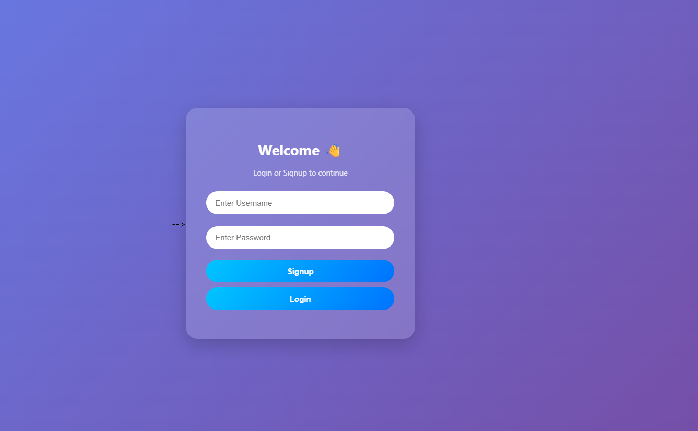
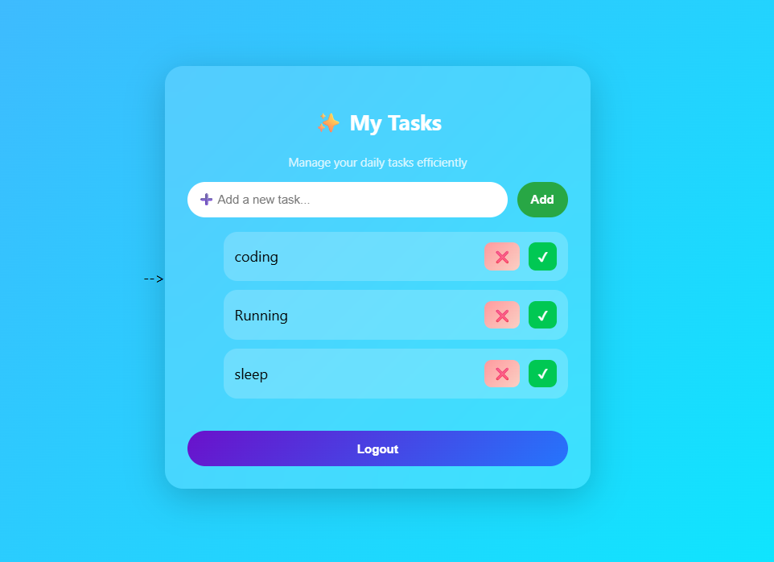

# 🚀 Todo App (Full Stack)

A modern and responsive **Todo Application** with authentication and task management features.
Built using **Node.js, Express, MongoDB Atlas, and Vanilla JavaScript**.

---

## ✨ Features

* 🔐 User Authentication (Signup & Login using JWT)
* 📝 Add new tasks
* ❌ Delete tasks
* ✔ Mark tasks as completed / undo
* 🔄 Real-time UI updates
* 🎨 Modern UI (Glassmorphism + Gradient Design)
* ☁️ MongoDB Atlas (Cloud Database)

---

## 🛠️ Tech Stack

**Frontend**

* HTML5
* CSS3
* JavaScript

**Backend**

* Node.js
* Express.js
* MongoDB (Mongoose)

**Authentication**

* JSON Web Token (JWT)

---

## 📸 Screenshots

### 🔑 Signup / Login Page



### 📋 Dashboard Page



---

## 📂 Project Structure

```
Todo-App/
│
├── backend/
│   ├── models/
│   ├── routes/
│   ├── server.js
│   ├── .env
│
├── frontend/
│   ├── index.html
│   ├── dashboard.html
│   ├── style.css
│   ├── script.js
│
├── screenshots/
│   ├── auth.png
│   ├── dashboard.png
│
├── .gitignore
├── package.json
└── README.md
```

---

## ⚙️ Setup Instructions

### 1️⃣ Clone the repository

```
git clone https://github.com/YOUR_USERNAME/todo-app.git
cd todo-app
```

---

### 2️⃣ Install dependencies

```
cd backend
npm install
```

---

### 3️⃣ Create `.env` file (IMPORTANT 🔐)

```
MONGO_URI=your_mongodb_connection_string
JWT_SECRET=your_secret_key
PORT=5000
```

---

### 4️⃣ Run the project

```
npm start
```

Frontend: http://127.0.0.1:8080
Backend: http://localhost:5000

---

## 🚀 Future Improvements

* ✏️ Edit task feature
* 📅 Due date
* 🔍 Search
* 🌙 Dark mode

---

## 🙌 Author

**Rinku**

---

## ⭐ Support

If you like this project, give it a ⭐ on GitHub!
